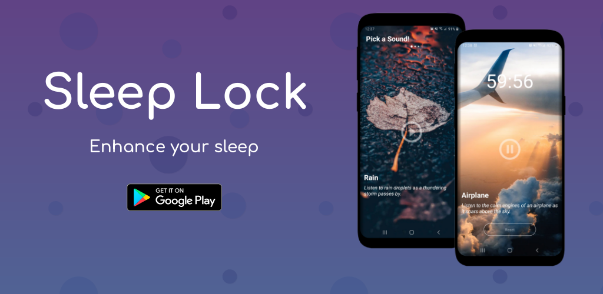

<h1 align="center">Sleep Lock</h1>

  

Using the power of white noise and sleep timers, Sleep Lock aims to help you relax and focus by helping you get the sleep you deserve.

## Download
You can download it from the playstore [right here.](https://play.google.com/store/apps/details?id=com.takari.sleeplock&hl=en_US)

## Tech stack & Open-source libraries
- Minimum SDK level 21
- Kotlin based
- Architecture
  - MVVM Architecture (View - ViewModel - Model)
  - Repository pattern
- [ViewModel](https://developer.android.com/topic/libraries/architecture/viewmodel) - used for surviving configuration changes and holding business logic for the views.
- [Live Data](https://developer.android.com/topic/libraries/architecture/livedata) - used to keep the view's data up to date.
- [Dagger2](https://dagger.dev/) - handles dependency injection/management.
- [Coroutines](https://github.com/Kotlin/kotlinx.coroutines) - used for reducing the complexity of asynchronous code and concurrency.
- [Kotlin Flow](https://kotlinlang.org/docs/reference/coroutines/flow.html) - used for simplistic cold observables
- [JUnit 5](https://junit.org/junit5/) - used for unit testing business logic.
- [Mockk](https://mockk.io/) - provides fake objects and stubs to help isolate code for unit testing.
- [Android KTX](https://developer.android.com/kotlin/ktx) - a set of Kotlin extensions.
- [KenBurns View](https://github.com/flavioarfaria/KenBurnsView) - provides an extension to ImageView that creates an immersive experience by animating its drawable using the Ken Burns Effect.
- [Android-Indefinite-Pager-Indicator](https://github.com/rbro112/Android-Indefinite-Pager-Indicator) - a lightweight, plug-and-play indefinite pager indicator for RecyclerViews & ViewPagers.
- [Fancy Buttons](https://github.com/medyo/fancybuttons) - gives access to beautiful custom made buttons.
- [Glide](https://github.com/bumptech/glide) - a tried and true image loading library for android.

## Architecture
Sleep Lock uses MVVM architecture and the Repository pattern for Separation of Concerns.

