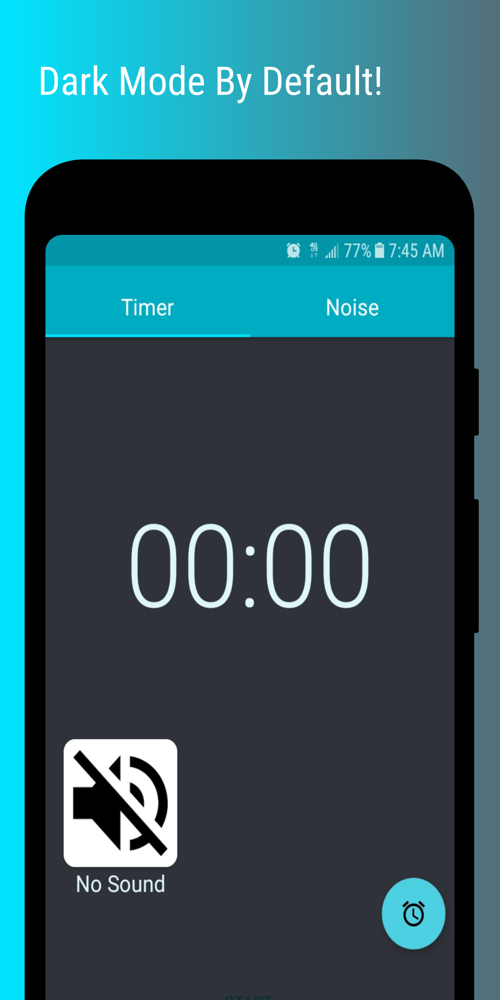
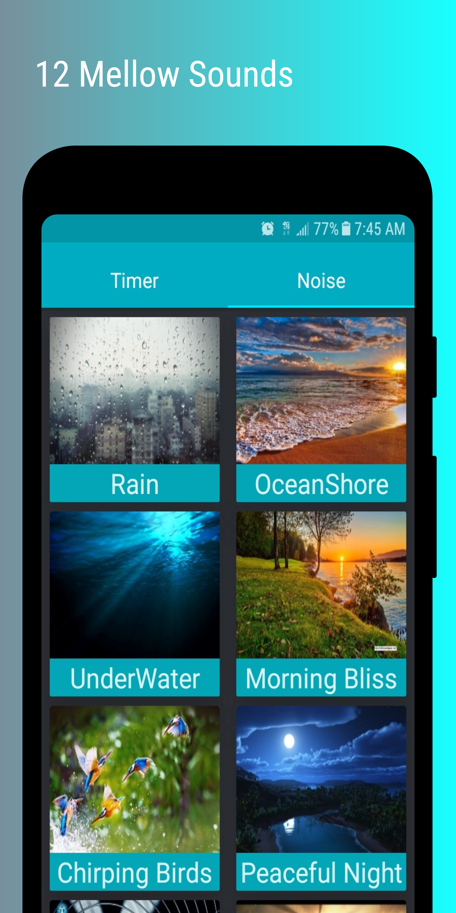
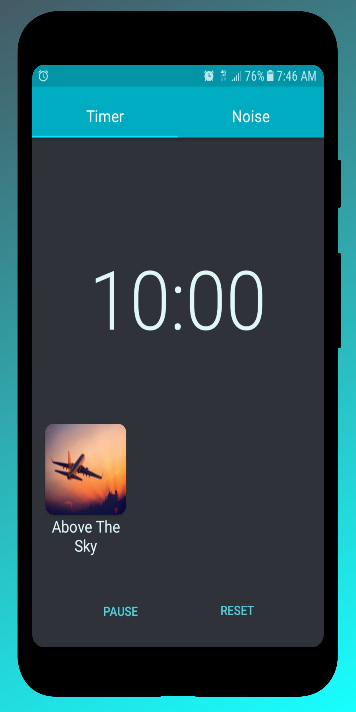

# SleepLock
SleepLock is a timer and white noise app that plays mellow sounds until the timer goes off. Perfect for sleeping and blocking out irritating noise!

  
   
  

## Installing
You can simply download it [here](https://play.google.com/store/apps/details?id=com.takari.sleeplock) from google play 

## Primarily Built With
* RxJava 
* Dagger2
* Lifecycle Libraries

## Contributing 
If you wish to contribute to this project email me first at takariharrison@gmail.com

## Acknowledgments
Pretty much everyone on r/androiddev, especially [this guy.](https://github.com/Zhuinden)
