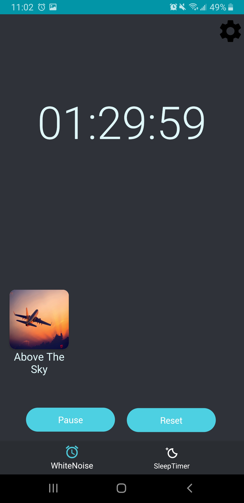
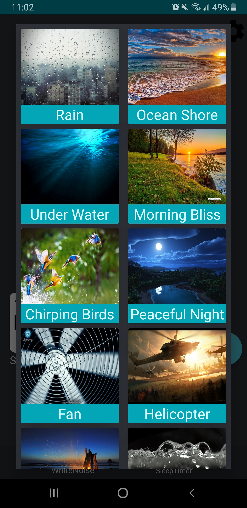
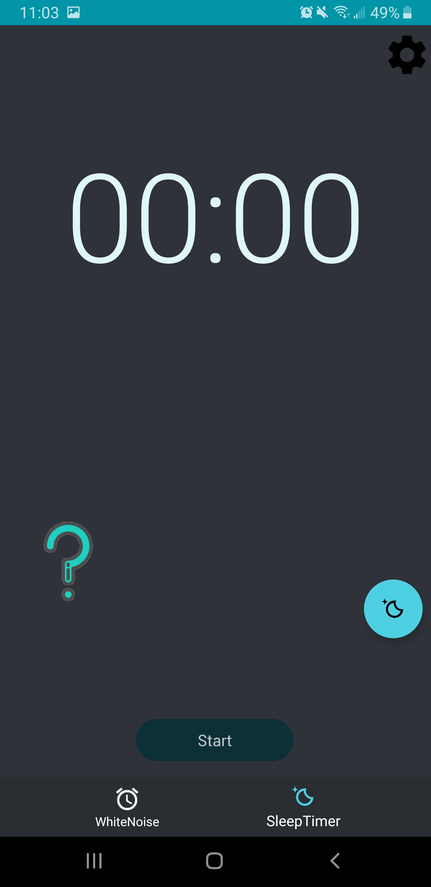
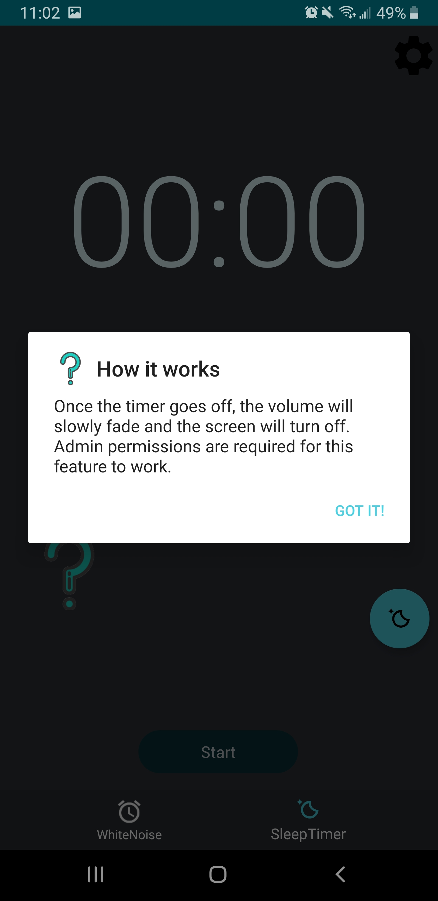

# SleepLock
SleepLock is a white noise player and sleep timer app built to help you uhh..."lock" your sleep? 

  
   
  
  

## Installing
You can simply download it [here](https://play.google.com/store/apps/details?id=com.takari.sleeplock) from google play 

## Primarily Built With
* RxJava 
* Dagger2
* Architecture Components
* MVVM

## Acknowledgments
Pretty much everyone on r/androiddev, especially [this guy.](https://github.com/Zhuinden)
